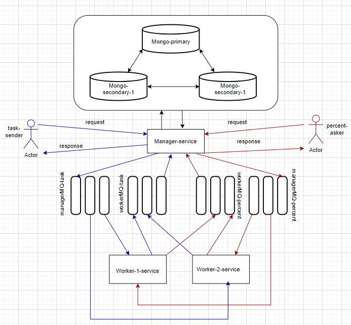

# Система для подбора пароля
На вход пользователем подается Md5-хэш и максимальная длина слова. Необходимо расшифровать пароль, используя brute-force.

## Функциональные требования
### 1) Обеспечить сохранность данных при отказе работы менеджера.

а. Необходимо обеспечить хранение данных об обрабатываемых запросах в базе данных MongoDB.

b. Необходимо организовать взаимодействие воркеров с менеджером через очередь RabbitMQ Для этого достаточно настроить очередь с direct exchange-ем. Если менеджер недоступен, то сообщения должны сохраняться в очереди до момента возобновления его работы

с. RabbitMQ также необходимо разместить в окружении docker-compose.

### 3) Обеспечить частичную отказоустойчивость базы данных.

a. База данных также должна быть отказоустойчивой, для этого требуется реализовать простое реплицирование для нереляционной базы MongoDB

b. Минимально рабочая схема одна primary нода, две secondary

c. Менеджер должен отвечать клиенту, что задача принята в работу только после того, как она была успешно сохранена в базу данных и отреплицирована

### 4) Обеспечить сохранность данных при отказе работы воркера(-ов).

a. В docker-compose необходимо разместить, как минимум, 2 воркера

b. Организовать взаимодействие менеджера с воркерами через очередь RabbitMQ (вторая, отдельная очередь), аналогично настроить direct exchange

c. В случае, если любой из воркеров при работе над задачей ”cломался” и не отдал ответ, то задача должна быть переотправлена другому воркеру, для этого необходимо корректно настроить механизм acknowledgement-ов

d. Если на момент создания задач нет доступных воркеров, то сообщения должны дождаться их появления в очереди, а затем отправлены на исполнение

### 5) Обеспечить сохранность данных при отказе работы очереди.

a. Если менеджер не может отправить задачи в очередь, то он должен сохранить их у себя в базе данных до момента восстановления доступности очереди, после чего снова отправить накопившиеся задачи

b. Очередь не должна терять сообщения при рестарте (или падении из-за ошибки), для этого все сообщения должны быть персистентными (это регулируется при их отправке)

## Как запустить проект
```
cd Ris_2
docker-compose up --build
```

Схема работы:



### Стек технологий
* Java 11
* Spring boot 
* RabbitMQ
* MongoDB
